
<h1 align="center">线上学习平台系统的设计与实现+vue</h1>

## 简介
线上学习平台系统：角色分为管理员和用户；功能包括课程管理、用户管理、论坛管理、考试管理、视频管理、公告信息管理，支持在线学习、课程收藏、试卷编辑与管理等功能。    --计算机毕业设计源码；毕设源码；java毕业设计源码

## 联系方式

<h3 align="center">获取完整代码与数据库文件 + 微信：deepguan QQ: 86050149 QQ群: 783742310</h3>

<h3 align="center">可帮忙远程部署 包运行成功！提供远程部署、修改代码、设计文档指导、代码讲解等服务！</h3>

## 功能介绍（完整见运行截图）
管理员：管理员可以在后台管理多个模块，包括用户管理、课程管理和试卷管理等。他们可以添加、编辑和删除用户信息，管理课程信息，设置和修改试卷，查看考试记录，以及使用左侧导航栏进入不同的管理功能模块。此外，管理员还可以进行公告信息管理、论坛管理和视频管理，提供上传和编辑视频内容以及公告的功能。对于试题和试卷的管理，管理员可以创建、修改和删除内容，设定题型、分值和解析，同时也能处理考试时间和及格分数等设置。

用户：用户可以通过首页导航访问个人中心、试卷库、论坛、课程及公告信息等模块。在个人中心，用户可以查看和修改个人信息、观看历史记录、考试成绩和收藏课程。通过论坛模块，用户能够浏览和发布帖子，与其他用户互动。课程模块提供课程搜索和收藏功能，用户可以管理自己感兴趣的课程。考试模块让用户参与考试并查看考试结果，查看错题记录以及进行在线答题。视频模块允许用户查看上传的视频内容，参与在线学习，系统消息和公告能及时通知用户相关动态。

## 运行截图
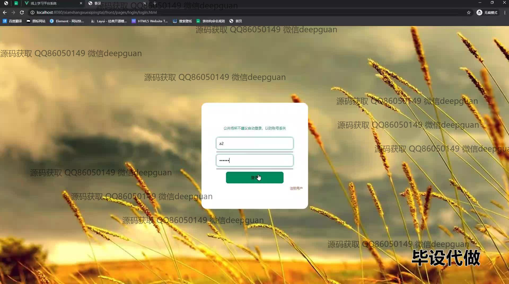
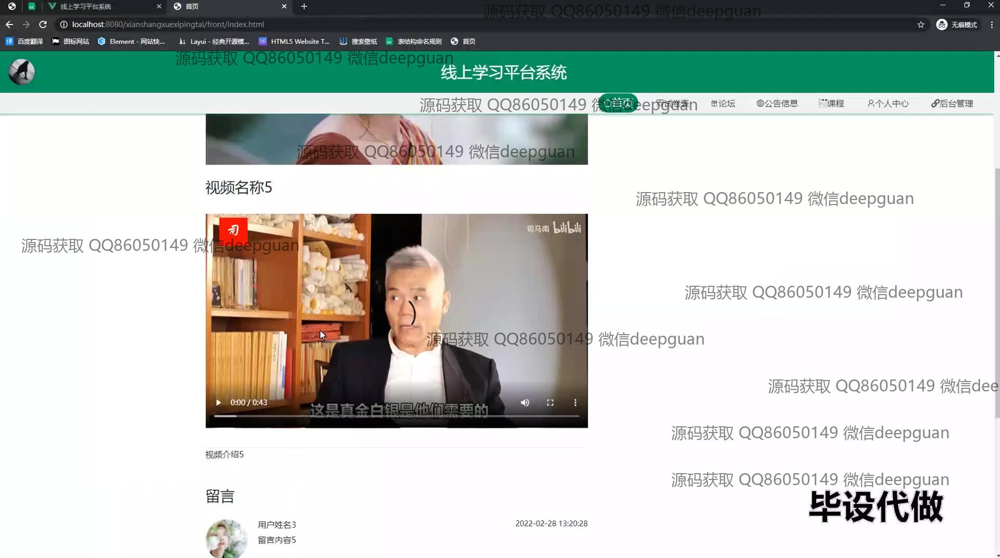
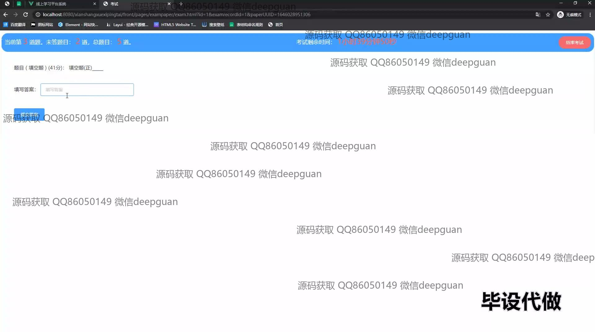
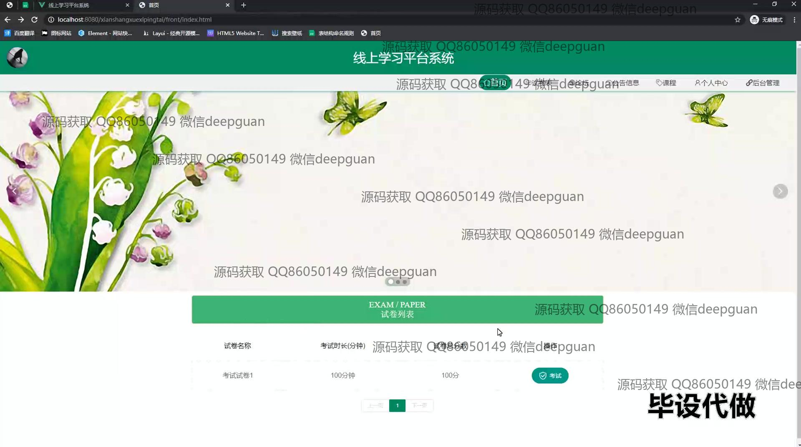
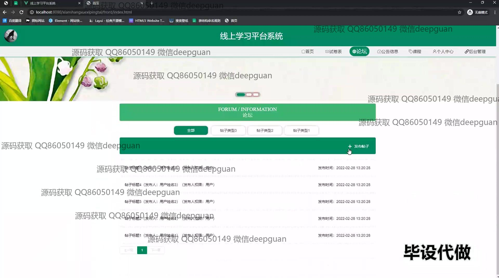
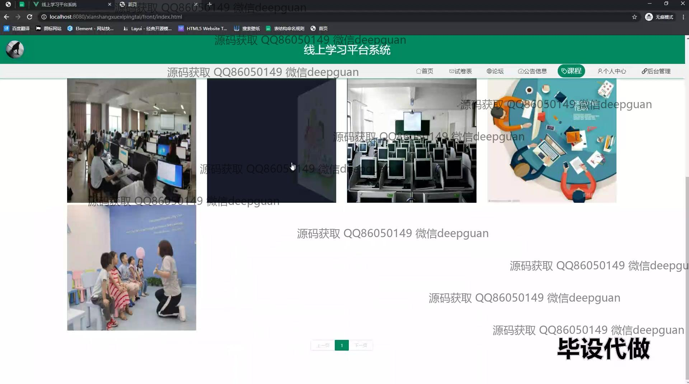
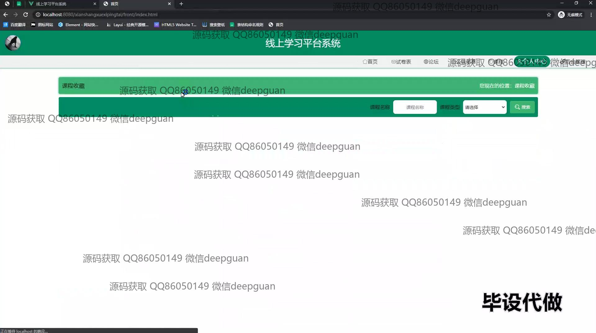
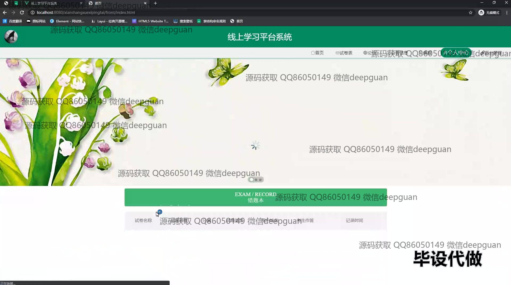
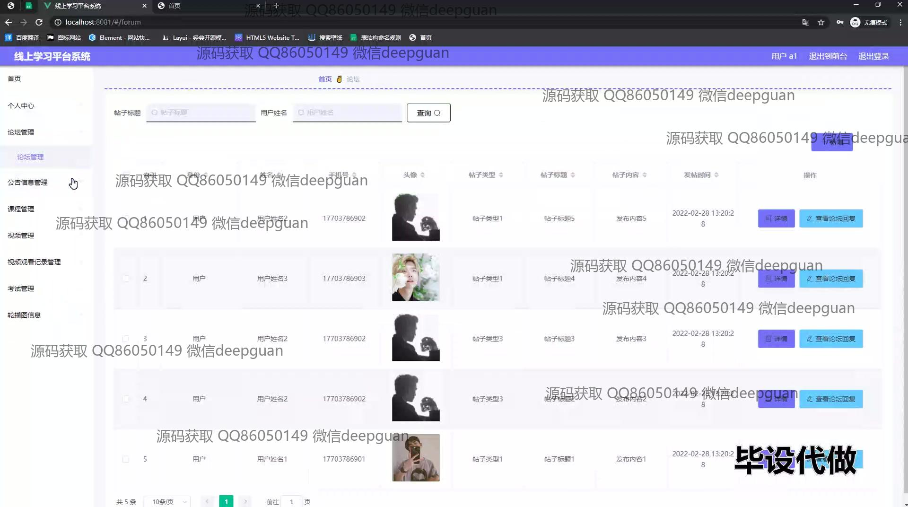
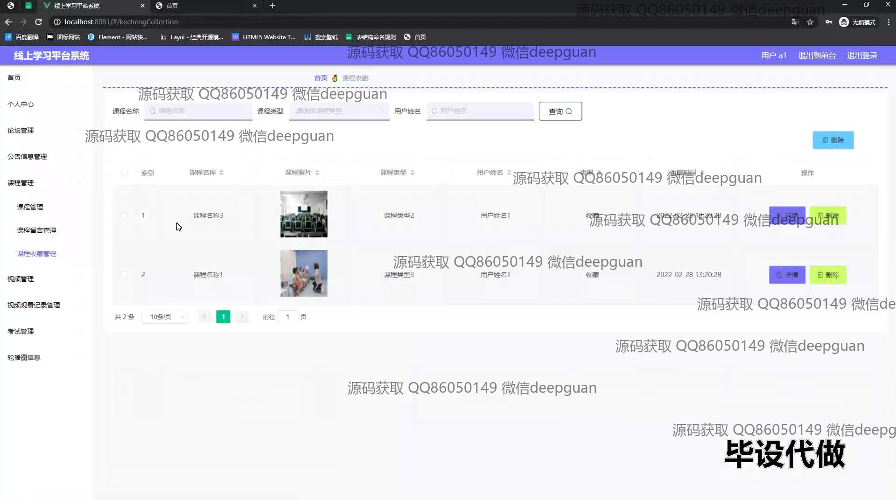
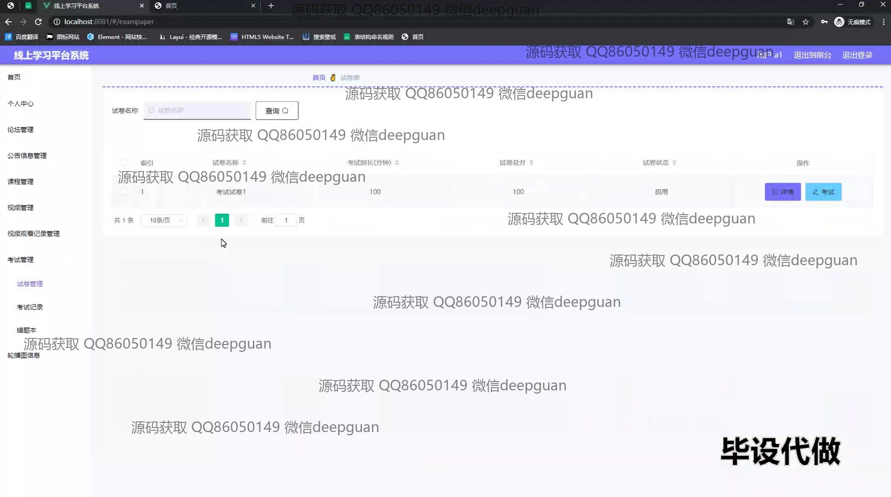

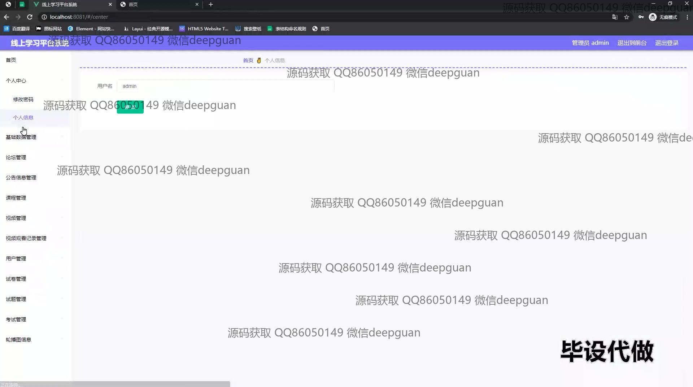

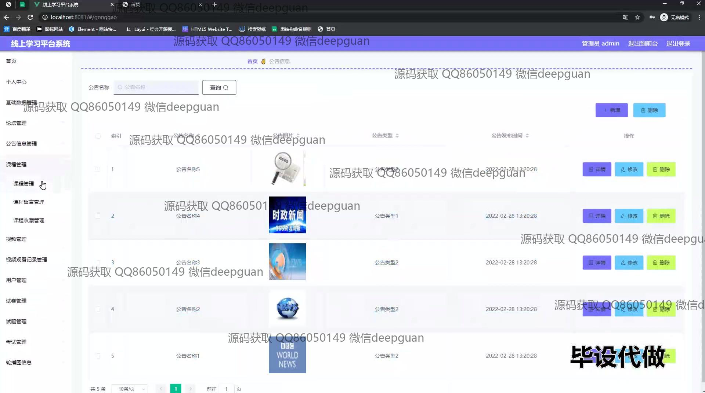
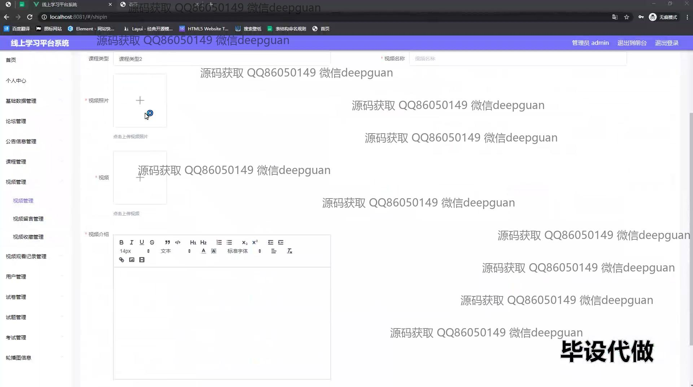
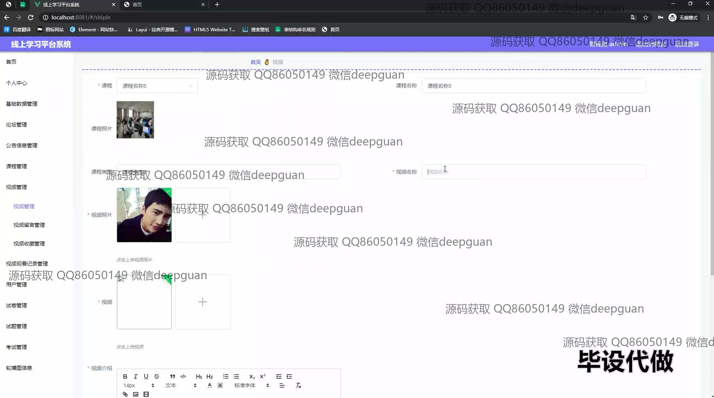

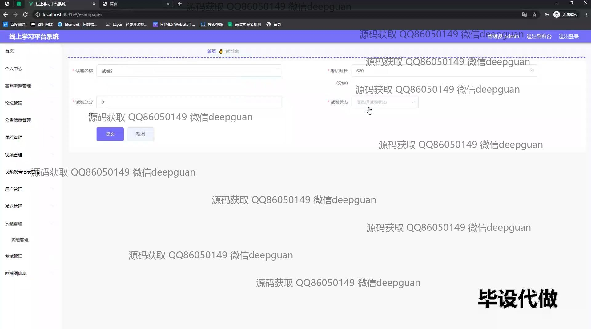
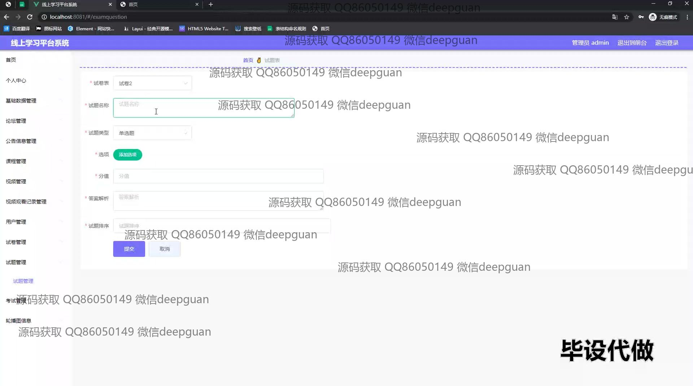
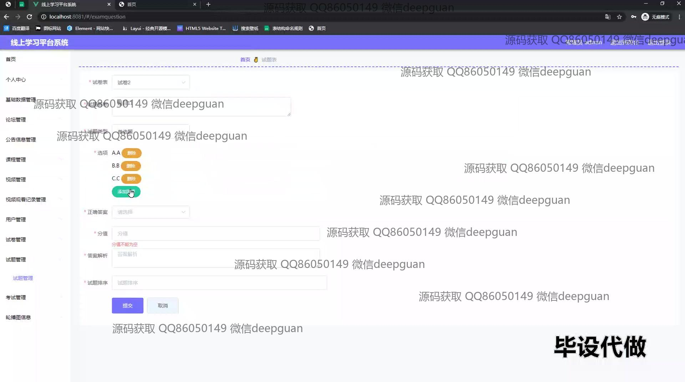
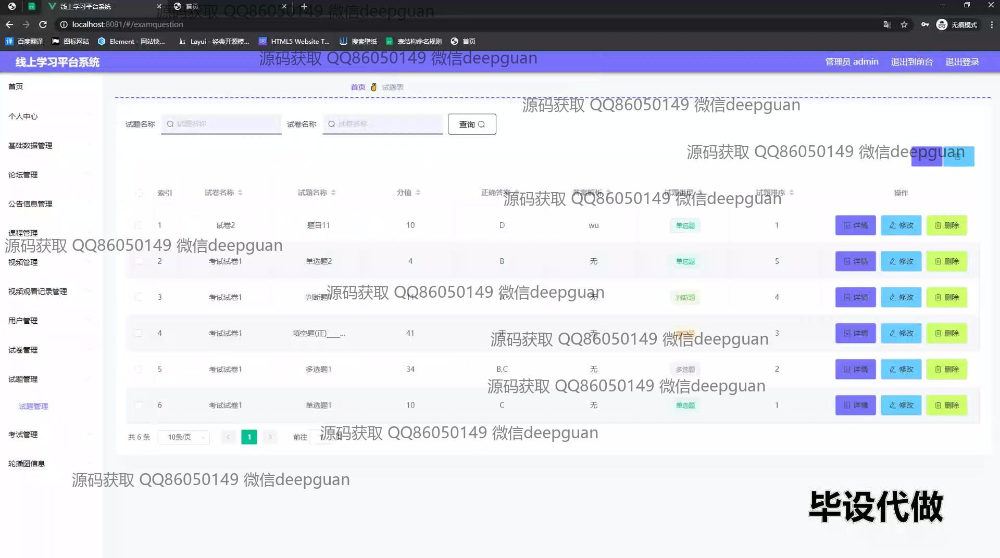

本代码来源于网络,仅供学习参考使用!

